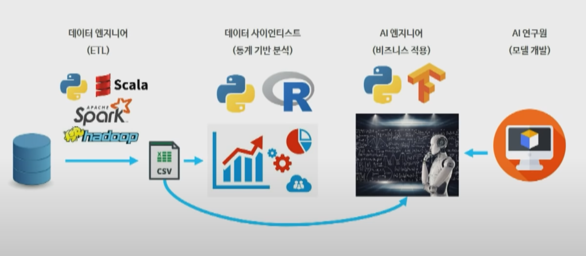

> YouTube 조코딩 채널  
> 2022.09.04, 2020.08.02 영상 참고

 
 

## 코딩 분야 소개

 

- **프론트엔드(클라이언트)**
    
    눈에 보이는 화면 (웹, 모바일, pc, 게임 등 화면) 
    
- **백엔드(서버)**
    
    안 보이는 정보 처리(서버)
    
- **데이터**
- **임베디드**
- **보안**

 
 
 

___

 
 
 

</img>

 

- 네이버 로그인
    - 데이터 : 로그인한 시간, 구매 기록들을 데이터로 기록 -> 추천 목록, 광고 생성 등으로 활용
        
    - 운영체제(임베디드) : 운영체제의 프론트엔드 부분이 하드웨어와 브라우저를 연결해줌
    - 보안 : 데이터 전송 중 보안

 
 
 

___

 
 

# 분야 별 공부 해야 하는 것

 

## 프론트엔드

 

- 웹
    
    - 화면구성
      - html : 뼈대구성
      - css : 디자인
      - js : 동적인 처리

       
    
    - 프레임워크(복잡한 기능구현) : React, AngularJS, Vue.js
    
- 앱
    - OS 특화된 개발
        
        - 안드로이드 : Java, Kotlin, Android Studio
        
          애플 : Swift, Objective-C, Xcode
        
        - 장점 : 가장 뛰어난 성능, 많은 기능 사용 가능
        
          단점 : 필요한 지식이 많아 개발 속도가 느림
        
    - 크로스플랫폼
        
        - React Native, Flutter, JS, Dart
        
        - 장점 : 빠른 개발 가능
        
          단점 : 네이티브 대비 낮은 성능 및 기능 제한
        
    - 하이브리드 앱
        
        - Html, Css, JS
        
        - 장점 : 빠른 개발 가능
        
          단점 : 네이티브 대비 낮은 성능 및 기능 제한
        
- PC
    - 윈도우
        
        - VSCode, C, C++, 비주얼베이직 등을 이용해서 XAML 로 화면을 구성
        
    - 맥
        
        - Xcode, Swift, OBjective-C
        
    - 크로스 플랫폼
        
        - 일렉트론 : Html, css, JS 기반으로 윈도우랑 맥에서 동시에 돌아가는 pc 프로그램
        
          슬랙, 아톰에디터, vs code
        
- 게임
    - Unity : 모바일, 캐주얼 게임
        
        C#
        
    - Unreal : 3d 위주
        
        C++
        
    - 두 개 모두 모바일, 3d 다 지원함

   

___

  

## 백엔드(서버)

 

- 대부분 프레임워크로 구성

  - Java - Spring

    Ruby - Rails

    python - Django

    JS - nodeJs

    C# - ASP.NET

    php - Laravel

 

  - 게임 - 성능 중요 > 직접 c,c++ tcp 방식으로 서버 구성

    요즘엔 서버less 

    aws, 구글 gcl 등을 이용해서 클라우드 함수를 이용해 정보를 처리하는 방식 사용함

   

___

  

## 데이터

 

네이버 로그인 후 실행한 모든 기록은 로그로 남고 그건 데이터가 됨

쌓인 데이터 기반으로 분석하고 연구해서 모델을 만들 수 있다 

 

</img>>

 

- 데이터 엔지니어(ETL)
    
    로그 상태의 데이터는 매우 지저분하다.
    
    이걸 깔끔하게 (csv등으로) 정리하는 일
    
    python, Scala, Spark, hadoop
    
     

- 데이터 사이언티스트(통계 기반 분석)
    
    정리 된 데이터를 바탕으로 분석해서 통계를 기반으로 의미있는 결과를 추출함
    
    python, R
    
     

- AI 연구원
    
    모델 학습 시켜서 예측을 하거나 하는데 해당 모델에 어떤 함수를 넣고 어떤식으로 동작하게 하는 지 개발함
    
     

- AI 엔지니어(비즈니스 적용)
    
    실제 비즈니스에 적용
    
    python
    

   

___

  

## 임베디드

 

- 하드웨어와 밀접한 개발

  하드웨어 제어 프로그램 및 특수목적의 응용프로그램을 개발

  로우레벨 언어 (컴퓨터 언어에 가까운 C, 어셈블리어) 사용

  하드웨어를 많이 이해해야함

  운영체제, 펌웨어 개발

   

___

  

## 정보 보안

- 앞서 설명한 모든 분야에 적용되는 분야

  - 방어자
    
    보안관제, 보안 솔루션 개발(백신), 포렌식(삭제정보 복구 등), 바이러스 분석
    
  - 공격자
    
    화이트 해커(모의해킹), 침해대응(CERT)(공격이 어디서 왔는지 분석), 
    
    취약점 진단, 사이버 수사

   

___

  

## ‘ 백문이 불여일타’

직접 쳐봐야 안다….ㅎㅎㅎㅎㅎㅎ

작은 부분이라도 직접 개발 해보면 감이 온다

만들어 보고 싶던 게 있으면 만들어보면 된다

두루 쓸 수 있는 언어

python, java, java script 취업하는데 많이 쓰는 건 java

하나 배워두면 나머지 공부하는 거 쉽다

그래도 어떤 분야에서 어떤 언어가 쓰이는 지 대략적으로 알 수 있는 좋은 공부였다!